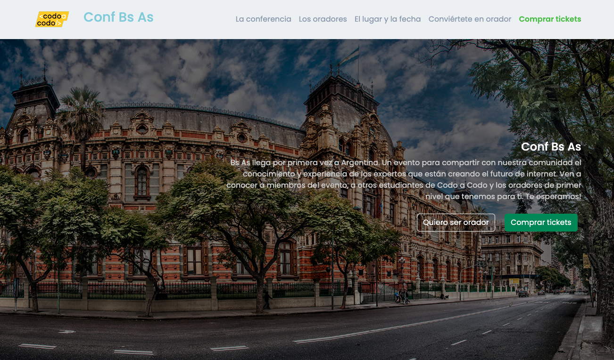
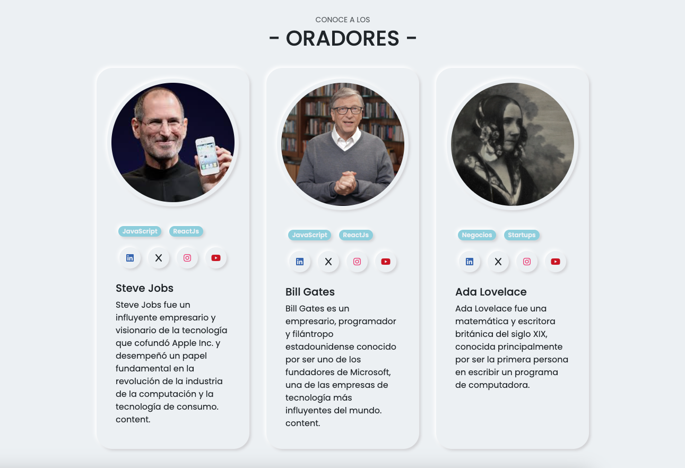
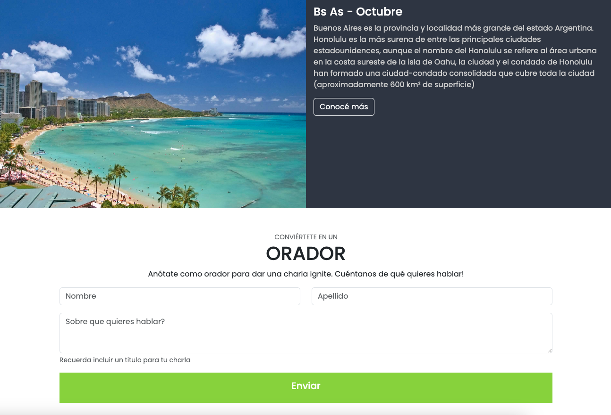

# Página web de la Conferencia "Conf BsAs"

Este repositorio contiene el código fuente de la página web de la conferencia
"Conf BsAs". Esta página web ha sido desarrollada utilizando el framework
Bootstrap para garantizar un diseño moderno y responsivo.

## Vista previa

Puedes ver una vista previa de la página web de la conferencia
[aquí](https://alehts29.github.io/TP_Integrador-Front/).

## Características

- Diseño responsivo para una experiencia óptima en dispositivos móviles,
  tabletas y computadoras de escritorio.
- Uso de componentes de Bootstrap para una apariencia profesional.
- Secciones de información sobre la conferencia, agenda, oradores y registro.
- Integración con Google Maps para mostrar la ubicación del evento.

## Tecnologías utilizadas

- [Bootstrap](https://getbootstrap.com/): Framework de código abierto para
  desarrollo web responsivo.
- HTML: Lenguaje de marcado para la estructura de la página.
- CSS: Hojas de estilo para el diseño y la presentación.
- JavaScript: Para la interacción del usuario y la integración de Google Maps.

## Capturas de pantalla





## Cómo usar

1. Clona este repositorio a tu máquina local:

   ```
   git clone https://github.com/AleHts29/TP_Integrador-Front.git
   ```

2. Abre el archivo `index.html` en tu navegador web.

## Contribución

Si deseas contribuir a este proyecto, por favor sigue los siguientes pasos:

1. Fork del repositorio.
2. Crea una rama (branch) para tu contribución:

   ```
   git checkout -b tu-feature
   ```

3. Realiza tus cambios y asegúrate de que el sitio siga funcionando
   correctamente.
4. Haz commit de tus cambios:

   ```
   git commit -m "Añade tu mensaje de commit aquí"
   ```

5. Sube tus cambios a tu repositorio:

   ```
   git push origin tu-feature
   ```

6. Abre un Pull Request en este repositorio.

## Créditos

Este proyecto fue desarrollado por
[Alejandro Huertas](https://github.com/AleHts29).

## Licencia

Este proyecto está bajo la Licencia MIT. Consulta el archivo [LICENSE](LICENSE)
para más detalles.

¡Gracias por visitar la página web de la conferencia "Conf BsAs"!
